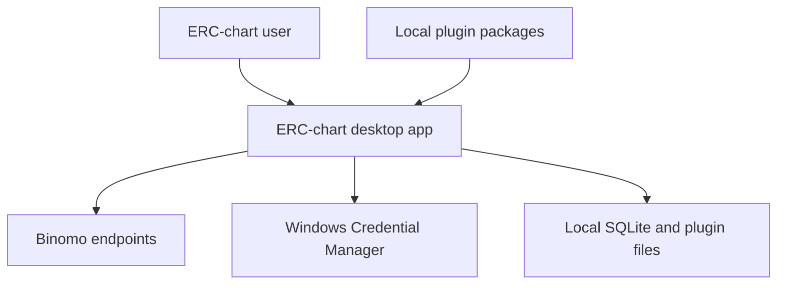
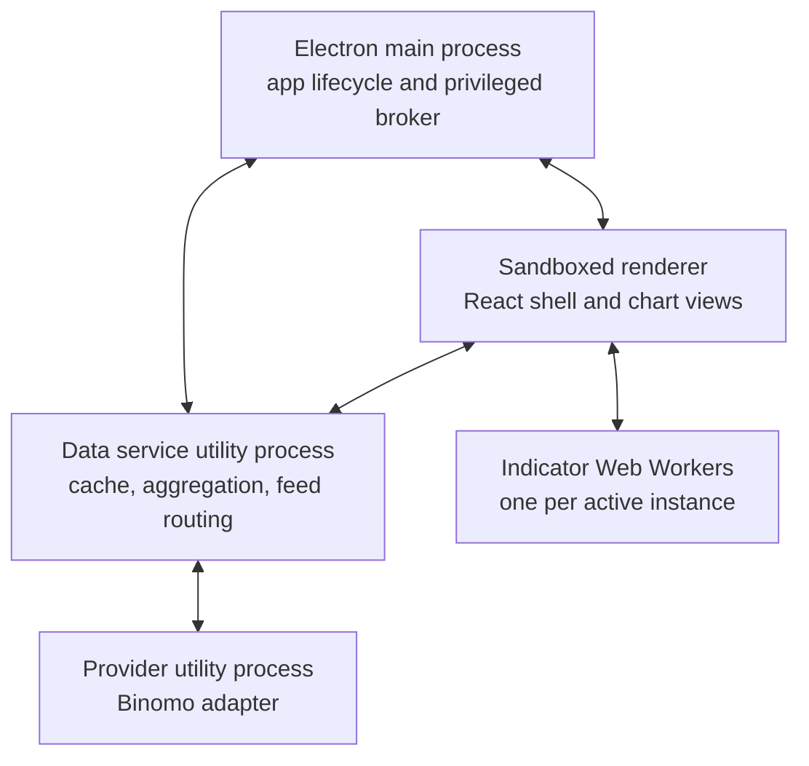
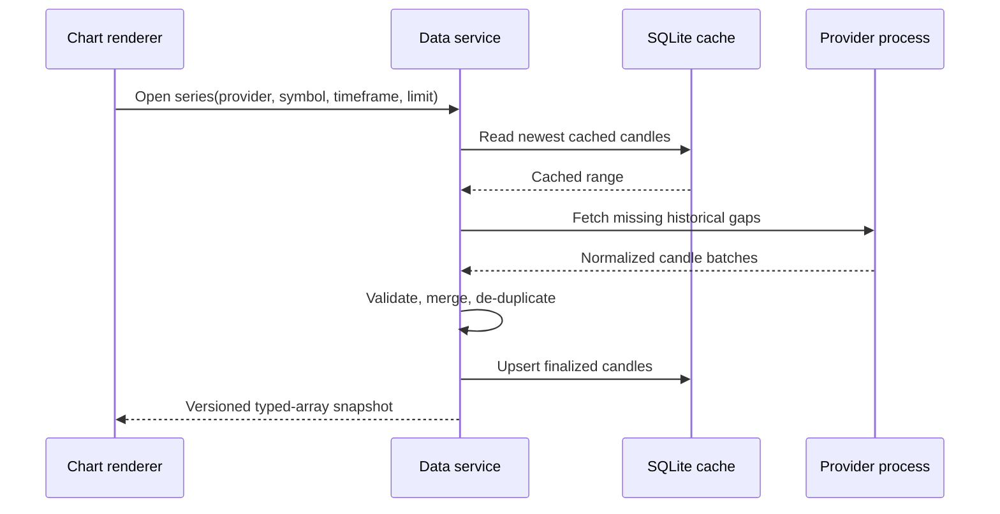
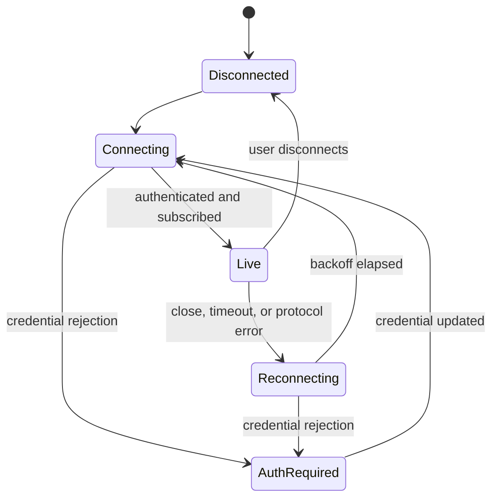
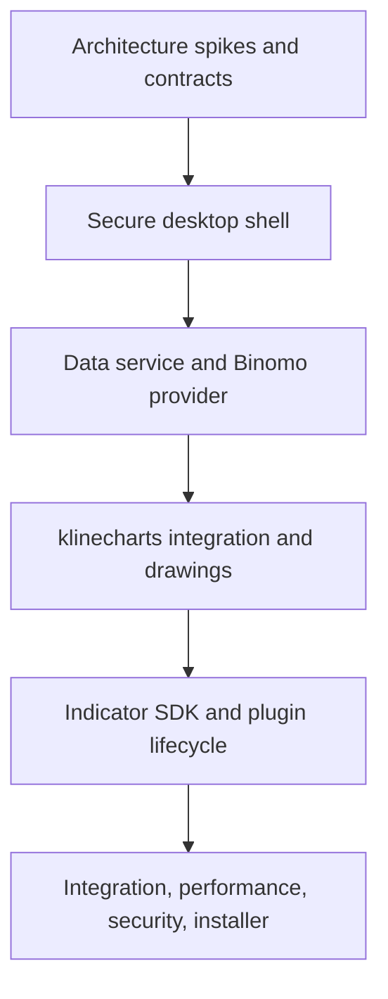

# ERC-chart Architecture and MVP Specification

## Document control

| Field               | Value                                           |
| ------------------- | ----------------------------------------------- |
| Product             | ERC-chart                                       |
| Document version    | 1.0 draft                                       |
| Date                | 2026-07-30                                      |
| Target release      | MVP                                             |
| Target platform     | Windows 10/11 x64                               |
| Distribution        | `.exe` installer                                |
| Primary theme       | Dark only                                       |
| Architecture status | Baseline for review and implementation planning |

## 1. Executive summary

ERC-chart will be a standalone desktop application for users who can install a normal Windows setup executable, launch the application, configure a data-provider credential, and use charts without development knowledge.

The MVP will:

- obtain historical candles and live ticks through installable data-provider plugins;
- ship first with a Binomo provider plugin;
- display candlestick, line, and area charts;
- support tabs and layouts containing up to four charts per application window;
- allow multiple independent ERC-chart application instances;
- provide zoom, pan, scale, crosshair, latest-candle navigation, indicator panels, and other confirmed reference interactions;
- provide trend line, horizontal line, vertical line, rectangle, Fibonacci retracement, and text/annotation drawing tools;
- run up to five JavaScript/TypeScript indicator instances per chart;
- give indicators candles, the building candle, live ticks, multi-timeframe data, and explicitly bound outputs of other indicators;
- install plugins from a local ZIP or folder;
- allow unsigned packages only when Developer Mode is enabled;
- cache finalized historical candles locally;
- save settings and workspaces locally;
- protect provider credentials with Windows Credential Manager; and
- install through a Windows x64 `.exe` package.

Signal broadcasting, signal consumers, replay, backtesting, trade execution, automatic updates, cloud synchronization, user accounts, plugin store, telemetry, licensing, localization, and theme switching are excluded from the MVP. A forward-compatible signal event shape is defined now so indicator plugins do not require a breaking redesign later.

The application will be implemented from zero. The supplied Signal project is evidence for desired behavior and Binomo protocol semantics, not a source tree to migrate or an architecture to preserve.

## 2. Confirmed product decisions

| Area                      | Confirmed decision                                                                                |
| ------------------------- | ------------------------------------------------------------------------------------------------- |
| Product name              | ERC-chart                                                                                         |
| First platform            | Windows 10/11 x64 only                                                                            |
| Installer                 | `.exe`                                                                                            |
| First provider            | Binomo                                                                                            |
| Per-window chart capacity | Four visible charts                                                                               |
| Additional windows        | Launch additional independent application instances                                               |
| Chart types               | Candlestick, line, area                                                                           |
| Timeframes                | Declared by the selected provider adapter; no hard-coded global list                              |
| Max active history        | 100,000 candles per chart series                                                                  |
| Max indicators            | Five active indicator instances per chart                                                         |
| Indicator languages       | JavaScript and TypeScript authoring; packaged runtime is ESM JavaScript                           |
| Indicator inputs          | Candles, building candle, live ticks, multi-timeframe series, bound outputs from other indicators |
| Plugin installation       | Local ZIP or folder                                                                               |
| Unsigned plugins          | Developer Mode only                                                                               |
| Plugin store              | Excluded from MVP                                                                                 |
| Historical cache          | Required                                                                                          |
| Settings/workspaces       | Local only                                                                                        |
| Drawing persistence       | Excluded from MVP; drawings exist only for the running session                                    |
| Accounts/cloud sync       | Excluded from MVP                                                                                 |
| Provider credentials      | Entered in the app and stored through Windows Credential Manager                                  |
| Offline mode              | Not a supported product mode                                                                      |
| Theme                     | Dark only in MVP                                                                                  |
| Automatic update          | Excluded from MVP                                                                                 |
| Languages                 | One UI language in MVP                                                                            |
| Crash analytics/telemetry | Excluded from MVP                                                                                 |
| Commercial licensing      | Excluded from MVP                                                                                 |
| Signal broadcasting       | First post-MVP phase                                                                              |

### Clarification: workspace versus drawing persistence

Workspaces and application settings are persisted locally in the MVP. A workspace stores tabs, chart layouts, provider profile references, symbols, timeframes, chart types, viewport state, and indicator configurations. It does **not** store drawing objects. Closing the application discards drawings.

### Clarification: cache versus offline mode

The historical cache exists to reduce provider requests, speed startup, and fill gaps. ERC-chart does not advertise or guarantee offline operation. Cached data may be shown while reconnecting, but it must be marked **Disconnected/Stale**, and live-dependent functions remain disabled until the provider is connected.

## 3. Goals, non-goals, and success definition

### 3.1 MVP goals

1. A non-developer can install and open ERC-chart on a supported Windows computer.
2. The user can create a Binomo provider profile and connect without exposing credentials in logs or workspace files.
3. The user can open provider-supported symbols and timeframes in independent chart slots.
4. Four active charts and five indicators per chart remain responsive at the defined performance workload.
5. Provider, indicator, and renderer failures do not crash the entire application.
6. Provider-specific and indicator-specific logic stays outside the application core.
7. New compatible provider and indicator packages can be added without recompiling the core application.
8. Local state is deterministic, schema-versioned, and recoverable after a normal application restart.

### 3.2 Explicit MVP non-goals

- broadcasting or delivering signals;
- configuring signal consumers;
- replay and backtesting;
- order placement or trade execution;
- trade-result monitoring and P/L reporting;
- optimizer workflows;
- saving or synchronizing drawings;
- a public plugin marketplace;
- automatic application or plugin updates;
- cloud accounts, cloud storage, or cross-device synchronization;
- mobile, browser, macOS, Linux, or Windows ARM64 releases;
- Python, native, or WebAssembly third-party plugins;
- a supported offline workflow;
- light theme, localization, remote analytics, or commercial licensing.

### 3.3 “Ready for use” acceptance statement

The MVP is ready when a clean Windows 10/11 x64 machine can install the signed or release-candidate setup executable, connect to Binomo, load and update charts, use the required interactions and drawings, run installable indicator plugins, restore a local workspace, survive tested plugin/provider failures, and meet the release performance and security gates in this document.

## 4. Functional requirements

### 4.1 Application shell and workspaces

| ID      | Requirement                                                                                           |
| ------- | ----------------------------------------------------------------------------------------------------- |
| APP-001 | Install and uninstall using a Windows x64 `.exe` installer.                                           |
| APP-002 | Run without requiring administrator rights for normal per-user installation.                          |
| APP-003 | Permit more than one independent ERC-chart process to run.                                            |
| APP-004 | Support multiple tabs per window.                                                                     |
| APP-005 | Support one-, two-, three-, and four-chart layouts, with no more than four visible charts per window. |
| APP-006 | Save and restore the last local workspace using a versioned schema.                                   |
| APP-007 | Use a dark theme only in the MVP.                                                                     |
| APP-008 | Show clear states for Connecting, Live, Reconnecting, Stale, Authentication Required, and Error.      |

### 4.2 Market data

| ID       | Requirement                                                                                                           |
| -------- | --------------------------------------------------------------------------------------------------------------------- |
| DATA-001 | Provider adapters declare their instruments, timeframes, data types, authentication fields, and endpoint permissions. |
| DATA-002 | Load up to 100,000 normalized candles into an active chart series.                                                    |
| DATA-003 | Receive live timestamped ticks and deterministically update a building candle.                                        |
| DATA-004 | Distinguish building and finalized candles.                                                                           |
| DATA-005 | Detect gaps, backfill history, de-duplicate equal bar times, and reject invalid OHLC records.                         |
| DATA-006 | Expose optional volume, bid, and ask fields only when a provider declares them.                                       |
| DATA-007 | Use provider-supplied bar-alignment metadata when deriving timeframes.                                                |
| DATA-008 | Keep live ticks in bounded memory for indicators; raw tick persistence is excluded from MVP.                          |

### 4.3 Charts and interactions

| ID        | Requirement                                                                                              |
| --------- | -------------------------------------------------------------------------------------------------------- |
| CHART-001 | Render candlestick, line, and area price charts.                                                         |
| CHART-002 | Mouse-wheel zoom is anchored to the pointer’s time position.                                             |
| CHART-003 | Horizontal pan supports historical data and controlled future space on the right.                        |
| CHART-004 | X-axis drag adjusts horizontal scale; double-click resets it.                                            |
| CHART-005 | Y-axis drag adjusts price scale; chart drag pans price vertically; reset returns to auto-scale.          |
| CHART-006 | Crosshair snaps to a candle on the time axis and displays time and price labels.                         |
| CHART-007 | Hover status displays OHLC values and change/percentage.                                                 |
| CHART-008 | A Jump to Latest action returns to the current building candle.                                          |
| CHART-009 | Timeframe and symbol changes cancel obsolete requests and cannot mix data from the previous selection.   |
| CHART-010 | Overlay indicators and separate indicator panels can be shown, hidden, configured, resized, and removed. |

### 4.4 Drawing tools

| ID       | Requirement                                                                                          |
| -------- | ---------------------------------------------------------------------------------------------------- |
| DRAW-001 | Trend line                                                                                           |
| DRAW-002 | Horizontal line                                                                                      |
| DRAW-003 | Vertical line                                                                                        |
| DRAW-004 | Rectangle                                                                                            |
| DRAW-005 | Fibonacci retracement                                                                                |
| DRAW-006 | Text/annotation                                                                                      |
| DRAW-007 | Select, move, resize, restyle, and delete supported drawing objects.                                 |
| DRAW-008 | Drawing undo/redo is deferred beyond MVP; the MVP does not maintain a bespoke drawing command stack. |
| DRAW-009 | Drawing objects are isolated per chart slot and discarded when the application exits.                |

### 4.5 Indicator plugins

| ID      | Requirement                                                                                                                 |
| ------- | --------------------------------------------------------------------------------------------------------------------------- |
| IND-001 | Maximum five active indicator instances per chart.                                                                          |
| IND-002 | Support overlay and separate-panel indicators.                                                                              |
| IND-003 | Provide typed OHLC arrays, time/index arrays, derived `HL2`, `HLC3`, and `OHLC4`, and building-candle state.                |
| IND-004 | Provide bounded live-tick events when requested by the plugin.                                                              |
| IND-005 | Provide multi-timeframe data only from timeframes declared available for the current provider/series.                       |
| IND-006 | Bind another indicator’s published output through an explicit instance/output reference.                                    |
| IND-007 | Build a dependency graph, calculate it in topological order, and reject missing or circular dependencies before activation. |
| IND-008 | Support line, horizontal line, histogram, band/fill, shape, box, and text plot primitives.                                  |
| IND-009 | Keep calculations off the UI thread and disable an indicator that repeatedly violates its execution budget.                 |
| IND-010 | Version indicator outputs by source-data revision to prevent stale results from being rendered.                             |

### 4.6 Plugin lifecycle

| ID       | Requirement                                                                                                     |
| -------- | --------------------------------------------------------------------------------------------------------------- |
| PLUG-001 | Install a plugin from a local ZIP or folder after manifest and package validation.                              |
| PLUG-002 | Production Mode accepts only packages trusted by the configured signing policy.                                 |
| PLUG-003 | Developer Mode may install unsigned packages only after an explicit persistent warning and application restart. |
| PLUG-004 | Never run package install scripts, `npm install`, executables, native `.node` modules, or Python.               |
| PLUG-005 | TypeScript is an authoring language; a distributable package must contain a precompiled ESM JavaScript entry.   |
| PLUG-006 | Stage and validate an installation before atomically activating it.                                             |
| PLUG-007 | Disable, enable, uninstall, and roll back activation without corrupting other plugins.                          |
| PLUG-008 | Enforce host API compatibility before loading a package.                                                        |

## 5. Quality attributes and provisional targets

The minimum PC specification is not yet confirmed. Until measured on user-selected hardware, use this provisional benchmark machine: Windows 10 or 11 x64, four logical CPU cores, 8 GB RAM, integrated graphics with hardware acceleration, and SSD storage.

| Attribute           | MVP target                                                                                                               |
| ------------------- | ------------------------------------------------------------------------------------------------------------------------ |
| UI responsiveness   | No provider, storage, or indicator calculation on the renderer UI thread                                                 |
| Rendering           | 60 FPS target during normal pan/zoom; p95 frame time below 33 ms under the four-chart stress workload                    |
| Live latency        | p95 below 100 ms from a normalized tick entering ERC-chart to visible update, excluding provider/network transit         |
| Cached history open | p95 below 2 seconds for 100,000 candles on the provisional benchmark                                                     |
| Memory              | No unbounded growth; soft target below 1 GB for one window with four 100,000-candle charts and five indicators per chart |
| Availability        | A provider or indicator crash must not terminate the application shell or unrelated chart tabs                           |
| Recovery            | Reconnect with bounded exponential backoff and historical gap repair                                                     |
| Data integrity      | Duplicate key protection, OHLC invariants, monotonic bar ordering, and atomic workspace writes                           |
| Security            | No plaintext provider credentials at rest; no secrets in logs; renderer Node integration disabled                        |
| Compatibility       | Versioned IPC, workspace, database, provider, indicator, and manifest contracts                                          |

Performance targets are release gates, not assumptions that the first implementation automatically satisfies.

## 6. Architecture style

ERC-chart is a modular desktop system with provider-neutral contracts, thin klinecharts renderer integration, and explicit process boundaries.

Key principles:

1. **Chart integration is provider-neutral.** No Binomo endpoint, cookie name, symbol format, or timeframe list belongs in renderer or workspace code.
2. **Indicator contracts are provider-neutral.** Indicator algorithms use an SDK contract and cannot import renderer or storage internals.
3. **Contracts cross boundaries.** IPC and plugin data is schema-validated and versioned.
4. **One owner per state.** The data service owns normalized series/cache state; the renderer owns transient viewport and drawings; indicator workers own calculation state; Credential Manager owns secrets.
5. **Render only visible data.** Loading 100,000 candles does not mean drawing 100,000 elements every frame.
6. **Fail locally.** Provider and indicator failures are supervised, surfaced, and contained.
7. **No hidden browser dependency.** The desktop Binomo adapter connects directly; it never hooks a Binomo browser tab.
8. **No credential downgrade.** TLS verification and secure secret storage cannot be disabled by plugin configuration.

## 7. Technology baseline

| Concern              | Baseline choice                                               | Reason                                                                                                    |
| -------------------- | ------------------------------------------------------------- | --------------------------------------------------------------------------------------------------------- |
| Desktop runtime      | Electron, current supported release at implementation time    | Mature Windows desktop process model and direct fit for JS/TS plugins                                     |
| Application language | TypeScript with strict compiler settings                      | Shared contracts across main, services, renderer, and SDK                                                 |
| UI shell             | React with domain state kept outside React components         | Tabs, layouts, settings, plugin management, and predictable UI composition                                |
| Chart engine         | klinecharts v10.0.3 integrated through `@erc-chart/renderer`  | Mature open-source financial charting with Canvas 2D, interactions, built-in overlays, and extension APIs |
| Rendering            | klinecharts Canvas 2D pipeline, hardware acceleration enabled | Rendering internals remain upstream; ERC-chart validates behavior and visible-workload performance        |
| Indicator isolation  | Node-disabled Chromium Web Workers                            | CPU work leaves UI thread; worker can be terminated on failure                                            |
| Provider isolation   | Electron utility process supervised by main/data service      | Separate crash boundary and MessagePort IPC                                                               |
| Local database       | SQLite in WAL mode                                            | Indexed local queries, transactions, schema migrations, multi-process readers                             |
| Secrets              | Windows Credential Manager through a small core-owned bridge  | Meets the confirmed credential-storage requirement                                                        |
| Installer            | electron-builder NSIS x64 `.exe`, per-user by default         | Produces the required Windows setup executable; automatic update remains disabled                         |
| Validation           | JSON Schema plus runtime TypeScript validators                | Reject malformed plugin, IPC, and persisted documents at boundaries                                       |

Architecture depends on explicit contracts and the pinned klinecharts version. Other library versions are pinned when implementation starts.

## 8. System context



There is no cloud service owned by ERC-chart in the MVP.

## 9. Process and container architecture



### 9.1 Electron main process

Responsibilities:

- application and window lifecycle;
- secure custom `erc-app://` and `erc-plugin://` protocols;
- narrow, validated preload API;
- IPC sender validation and routing;
- plugin installation, trust, activation, and removal;
- Developer Mode state;
- Credential Manager access;
- launching and supervising utility processes;
- local diagnostics and orderly shutdown;
- installer/update policy reporting, with updates disabled in MVP.

The main process does not calculate indicators, render charts, or implement Binomo protocol logic.

### 9.2 Sandboxed renderer

Responsibilities:

- React application shell;
- tabs and one-to-four chart layouts;
- klinecharts instances and canvas surfaces;
- transient viewport, crosshair, selection, and session drawings;
- symbol/timeframe/indicator/plugin management UI;
- presentation of connection and error states;
- routing normalized data to chart views;
- supervising Node-disabled indicator Web Workers.

Security settings:

- `nodeIntegration: false`;
- `nodeIntegrationInWorker: false`;
- `contextIsolation: true`;
- `sandbox: true`;
- `webSecurity: true`;
- restrictive Content Security Policy;
- navigation and new-window creation denied by default;
- only narrow application-specific APIs exposed from preload.

### 9.3 Data service utility process

Responsibilities:

- SQLite migrations and queries;
- normalized candle cache;
- per-series in-memory typed-array store;
- live tick routing and bounded tick buffers;
- candle building/finalization;
- historical merge, de-duplication, gap detection, and retention;
- subscription multiplexing across chart slots in one application instance;
- workspace persistence coordination;
- provider-process supervision requests;
- binary snapshot delivery through transferable buffers.

Only this layer exposes the canonical market-data revision used by renderers and indicators.

### 9.4 Provider utility process

One supervised process is created per active provider profile. It:

- loads one validated provider adapter;
- establishes REST/WebSocket connections;
- performs protocol heartbeats, subscriptions, reconnect, and resubscription;
- normalizes adapter output to the provider contract;
- receives credentials through IPC only after launch;
- emits health/status events;
- exits cleanly on profile disconnect.

Process isolation protects the application from a provider crash. It is not, by itself, a complete security boundary against deliberately malicious Node code. Therefore production accepts trusted provider packages only; unsigned provider packages are limited to Developer Mode with a strong warning.

### 9.5 Indicator workers

Each active indicator instance runs in a Node-disabled Web Worker. The maximum is five per chart.

The worker:

- receives an initial typed-array snapshot;
- applies incremental tick/bar updates after initial calculation;
- publishes declared output series and plot instructions;
- has no Electron, filesystem, process, credential, or direct provider API;
- is terminated on timeout, crash, protocol violation, or removal.

An unsigned Developer Mode indicator gets the same browser worker restrictions. CSP denies arbitrary network access.

## 10. Runtime data flows

### 10.1 Historical load



Rules:

- request identity includes provider profile, instrument, timeframe, and a generation number;
- an obsolete response is discarded after symbol/timeframe change;
- equal `(feed, instrument, timeframe, open time)` records use deterministic last-valid-source precedence;
- a building candle is never persisted as finalized;
- a chart receives no more than 100,000 active candles.

### 10.2 Live update and reconnect



On a live tick:

1. Provider process emits a normalized tick with provider receive time.
2. Data service validates the symbol, timestamp, price, and optional sequence.
3. Duplicate/out-of-order policy is applied.
4. Bounded tick subscribers are notified.
5. Candle builder updates or finalizes affected active timeframes.
6. The canonical series revision increments.
7. Renderer and indicator workers receive compact deltas.
8. The renderer schedules one animation-frame redraw rather than drawing per message.

After reconnect, the data service backfills from the latest finalized bar before accepting the feed as fully Live.

## 11. Canonical market-data model

All timestamps are integer Unix milliseconds in UTC at contract boundaries.

### Candle

- provider/feed ID;
- instrument ID;
- timeframe in positive integer seconds;
- `openTimeMs`;
- optional `closeTimeMs`;
- finite `open`, `high`, `low`, and `close`;
- optional finite `volume`;
- `isFinal`;
- monotonically increasing `revision`.

Required invariants:

- `high >= max(open, close)`;
- `low <= min(open, close)`;
- `openTimeMs` follows the adapter’s alignment rule;
- finalized bars are unique by feed/instrument/timeframe/open time;
- no `NaN`, infinity, or silently coerced invalid number enters the store.

### Tick

- provider/feed ID;
- instrument ID;
- `timeMs`;
- finite `price`;
- optional `bid`, `ask`, `volume`, and provider sequence;
- local receive time for diagnostics.

Volume, bid, and ask are optional capabilities because the supplied Binomo reference does not provide them.

### Derived price sources

The chart/indicator SDK supplies zero-copy or cached arrays for:

- `HL2 = (high + low) / 2`;
- `HLC3 = (high + low + close) / 3`;
- `OHLC4 = (open + high + low + close) / 4`.

## 12. Binomo provider design

### 12.1 Observed protocol evidence

The supplied reference shows:

- historical candles from `https://api.binomo.com/candles/v1/...`;
- live asset ticks from `wss://as.binomo.com/` using a `rics` subscription;
- an authenticated Phoenix-style connection at `wss://ws.binomo.com/?v=2&vsn=2.0.0`;
- Binomo historical `created_at` treated as candle close time, with opening time derived by subtracting the timeframe;
- UTC/epoch-aligned custom timeframe aggregation;
- retry/backoff and backward chunk pagination.

The TypeScript adapter must reproduce confirmed protocol semantics, not copy the browser hook or Python implementation.

### 12.2 Production constraints

- TLS certificate validation is always enabled.
- No “browser mimic,” weak-cipher override, or certificate-verification bypass is permitted.
- No hard-coded cookie, token, or device identifier is permitted.
- Credentials are referenced as `authtoken` and `device_id` in the provider profile and retrieved from Credential Manager.
- Logs redact cookies, authorization headers, query secrets, and device identifiers.
- Endpoint and protocol changes produce a clear Provider Incompatible state rather than silently falling back to a browser hook.

### 12.3 Protocol validation spike

Before full provider implementation, verify on a test account:

1. current TLS compatibility without disabled verification;
2. required authentication fields and expiry/renewal behavior;
3. instrument discovery or the source of an initial instrument catalogue;
4. historical endpoint pagination, timestamp semantics, and rate limits;
5. live subscription format, heartbeat, reconnect, and sequence behavior;
6. native and safely derived timeframes;
7. provider terms and permission to use the protocol in a distributed desktop client.

Binomo endpoints observed in the reference appear to be private implementation interfaces rather than a documented stable public SDK. Protocol drift is therefore a high product risk and must remain isolated inside the adapter.

## 13. Chart engine design

### 13.1 klinecharts integration

The custom `@erc-chart/chart-core` package has been removed (see ADR-015). Chart rendering, interaction, and drawing are provided by klinecharts v10, integrated within `@erc-chart/renderer`.

Integration responsibilities:

- **Data adapter**: bridges `@erc-chart/data-service` candle feeds into klinecharts data format;
- **Theme/style configuration**: applies ERC-chart dark theme through klinecharts style API;
- **Chart instance management**: creates/destroys klinecharts instances per chart slot;
- **Indicator overlay bridge**: maps indicator SDK plot outputs to klinecharts custom technical indicator and overlay APIs;
- **Drawing integration**: configures built-in overlays and registers thin rectangle/text overlay extensions composed from klinecharts figures;
- **Event observation**: observes klinecharts viewport, crosshair, and interaction events for workspace state and UI coordination.

### 13.2 Rendering

klinecharts handles all Canvas 2D rendering internally with its own layered rendering pipeline. ERC-chart does not manage canvas layers, dirty regions, or viewport math directly.

### 13.3 Chart types

- **Candlestick:** klinecharts `candle_solid` / `candle_stroke` / `candle_up_stroke` / `candle_down_stroke` styles.
- **Line:** klinecharts area presentation with transparent fill; use a thin presentation extension only if behavioral parity cannot be met through styles.
- **Area:** klinecharts native area presentation.

Changing chart type never changes underlying market data or indicator calculations.

### 13.4 Drawings

klinecharts supplies built-in overlays for Fibonacci, horizontal/vertical lines, annotations, and tags. ERC-chart adds only thin rectangle and free-text overlay definitions using klinecharts `rect` and `text` figures. These extensions use klinecharts coordinates, lifecycle, selection, and rendering; ERC-chart does not build a separate chart engine or coordinate renderer. Drawings are session-only, the workspace serializer omits them in schema version 1, and MVP undo/redo is intentionally deferred.

## 14. Indicator architecture

### 14.1 Authoring model

The SDK is TypeScript-first and also usable from JavaScript. The accepted authoring facade is defined by ADR-016 and `SDK-IMPLEMENTATION-DECISIONS.md`. Authors use direct series aliases and declarative helpers, for example:

```ts
const rsi = ta.rsi(14);
const trend = ta.ema({ length: 50, value: close, tf: "1h" });
```

No public runtime `ctx`, renderer, provider adapter, transport, or klinecharts object is exposed. Authors declare:

- plugin metadata and host API compatibility;
- configuration schema;
- typed calculation inputs and presentation styles;
- output series and plot definitions;
- `ta.*` dependencies, including multi-timeframe calls, through ordinary author expressions;
- optional explicit cross-indicator bindings;
- signal-candidate production where allowed by the current product phase.

A distributable plugin contains precompiled ESM JavaScript. ERC-chart never runs arbitrary build scripts during installation.

### 14.2 Inputs and dependency graph

The runtime normalizes each `ta.*` call into a hidden dependency on canonical market data. Omitted source means `close`; omitted timeframe means the active chart timeframe. A declared input may bind to one of:

- current chart candles;
- a specific available timeframe;
- bounded live ticks;
- another indicator instance and published output key.

The chart builds a directed graph from explicit instance bindings. It:

1. verifies every dependency exists and is type-compatible;
2. rejects self-reference and cycles;
3. calculates independent graph layers in parallel;
4. runs dependent layers after their inputs publish the same source revision;
5. invalidates downstream results when an upstream configuration or source changes.

Name-only lookup is not accepted because duplicate indicator names are ambiguous.

Equivalent TA dependencies may share upstream canonical series/subscriptions while retaining isolated instance calculation state. Provider capabilities remain authoritative for native or safely derived timeframes, and background MTF access never changes the visible chart timeframe.

### 14.3 Output and plot contract

Indicators publish named, typed numeric/boolean results. The renderer maps those normalized, revision-tagged results into klinecharts technical-indicator/overlay APIs. Supported MVP presentation primitives:

- line;
- horizontal line;
- histogram;
- upper/lower band and fill;
- shape/marker;
- line segment;
- box/rectangle;
- text.

The host, not plugin code, performs canvas drawing. Malformed coordinates, excessive object counts, unsupported styles, and stale revisions are rejected. The renderer's pinned klinecharts adapter validates `indicator.result`, correlates it with canonical candle timestamps/revisions, and fails closed on an unknown dependency layout; raw klinecharts objects never cross the plugin boundary.

### 14.4 Calculation lifecycle

- Initial history calculation may process up to 100,000 candles inside the worker.
- Incremental updates append/finalize one bar where the algorithm supports it.
- Steady-state SMA, EMA, RSI, ATR, and crossover updates are O(1); highest/lowest updates are amortized O(1).
- Initial history may be O(N); reconfiguration or corrected history may rebuild O(N) or the correctness-relevant dirty range.
- A mutable building bar derives provisional state from the last committed bar; replacement does not compound provisional rolling state.
- Building-candle recalculation is distinct from finalization.
- A configuration change creates a new calculation generation.
- Results from an older generation or data revision are discarded.
- A worker has a startup budget, per-update budget, output-size quota, and crash/restart counter.
- Repeated violations disable that indicator instance and show a user-visible error.

### 14.5 Future signal compatibility

An indicator may create a `SignalCandidate` containing:

- unique event ID;
- indicator plugin and instance IDs;
- provider/feed, instrument, and timeframe;
- direction/type;
- event time and related bar time;
- finalized/provisional state;
- optional confidence and JSON metadata;
- source-data revision.

In the MVP this is an inert contract: there is no delivery bus, consumer configuration, retry, persistence, or external broadcast. Implementing those belongs to Post-MVP Phase 1.

The host nevertheless maintains a bounded normalized result tail so future signal processing can read the latest result in O(1) or the last N results in O(N requested), without scanning complete candle history. Actionable reads default to finalized values; provisional reads must be explicit and retain provisional state.

## 15. Plugin package and trust model

### 15.1 Package layout

```text
plugin-package/
  plugin.json
  dist/
    index.js
    optional-modules.js
  assets/
    optional-static-assets
  LICENSE
```

No package may contain executable installers, native libraries, Python, or install hooks.

### 15.2 Installation pipeline

1. Copy the selected ZIP/folder into an application staging directory.
2. Enforce package size, file-count, path-length, and extension limits.
3. Reject absolute paths, traversal (`..`), links/reparse points, and duplicate normalized paths.
4. Parse and validate `plugin.json`.
5. Validate ID, semantic version, host API range, entry path, permissions, and declared kind.
6. Compute file hashes and validate signature/integrity when required.
7. Perform static policy checks and a short isolated load probe.
8. Atomically move the package to its versioned installation directory.
9. Register it as disabled if permissions need review; otherwise activate.
10. Preserve the previously active version until the new version starts successfully.

### 15.3 Production Mode

- bundled first-party packages and trusted signed packages only;
- no remote plugin download or store;
- no unsigned override;
- permission changes require re-approval;
- plugin entry points never load from arbitrary `file://` URLs.

### 15.4 Developer Mode

- unsigned local packages are allowed;
- a persistent banner identifies Developer Mode;
- enabling it requires explicit warning acceptance and restart;
- provider plugins are clearly described as capable of harming local data because process isolation is not a malicious-code sandbox;
- all normal manifest, traversal, API-compatibility, output, timeout, and CSP checks still apply.

## 16. Local storage design

### 16.1 Locations

Use Windows per-user application data:

```text
%LOCALAPPDATA%\ERC-chart\
  data\erc-chart.sqlite3
  plugins\<kind>\<id>\<version>\
  logs\
  temp\
```

Secrets are not stored in this tree.

### 16.2 Logical SQLite schema

| Table                | Key/purpose                                                                   |
| -------------------- | ----------------------------------------------------------------------------- |
| `schema_migrations`  | Applied database versions                                                     |
| `provider_profiles`  | Non-secret profile metadata and Credential Manager target reference           |
| `instruments`        | Provider instrument catalogue and metadata                                    |
| `candles`            | `(feed_id, instrument_id, timeframe_sec, open_time_ms)` unique finalized bars |
| `series_cache_state` | Range, revision, last synchronization, and retention metadata                 |
| `workspaces`         | Versioned local workspace JSON and timestamps                                 |
| `plugins`            | Installed versions, kind, trust, status, manifest, and hash                   |
| `plugin_permissions` | Reviewed permission grants                                                    |
| `app_settings`       | Versioned application settings                                                |
| `diagnostic_events`  | Bounded, redacted local events when local diagnostics are enabled             |

Raw ticks and session drawing objects are not persisted in the MVP.

### 16.3 Candle retention and queries

- active retrieval hard limit: 100,000 candles per series;
- finalized bars stored only;
- batched prepared upsert transaction;
- newest-N retrieval through a covering series/time index;
- cache pruning by per-series limit in MVP;
- corrupted or semantically invalid cache rows are quarantined or deleted and can be fetched again.

### 16.4 Multi-instance coordination

ERC-chart does not take a single-instance lock. Each instance has its own processes and workspace session but accesses the same per-user database.

Use:

- SQLite WAL mode;
- short write transactions;
- a busy timeout and bounded retry;
- idempotent unique-key upserts;
- no network or long calculations inside a transaction;
- instance IDs in workspace-session metadata;
- atomic last-writer-wins only for explicitly shared settings.

If the same workspace is open in two instances, each instance saves to its own session copy. The user must explicitly overwrite the named workspace to avoid silent state loss.

## 17. Credential design

Provider secrets are stored as Generic Credentials in Windows Credential Manager using stable targets such as:

```text
ERC-chart/provider/<provider-id>/<profile-id>
```

Rules:

- secret fields never enter workspace, plugin manifest, SQLite, argv, environment variables, crash text, or normal logs;
- renderer sends secret values only through a narrow secure profile API;
- main writes/reads Credential Manager and sends required fields to the provider process over IPC;
- plugin code receives only fields declared by its manifest and approved by the user;
- values are retained in memory for the shortest practical connection lifetime;
- deletion of a provider profile deletes the associated credential;
- failure to access Credential Manager fails closed; plaintext fallback is forbidden.

The credential embedded in the supplied Python reference must be treated as compromised and rotated if it was ever valid.

## 18. Security architecture and threat controls

| Threat                             | Primary controls                                                                                                         |
| ---------------------------------- | ------------------------------------------------------------------------------------------------------------------------ |
| Renderer/XSS obtains native access | Local custom protocol, CSP, sandbox, context isolation, Node disabled, narrow preload API                                |
| IPC spoofing or malformed messages | Sender validation, allowlisted channels, schema validation, request generation/revision checks                           |
| Malicious ZIP path traversal       | Staging, canonical path checks, link/reparse rejection, quotas, atomic activation                                        |
| Malicious indicator                | Node-disabled Web Worker, CSP network denial, typed API, output quotas, timeout/termination                              |
| Malicious provider                 | Production trust/signature requirement, separate process, permission declaration, secret scoping, Developer Mode warning |
| Credential theft from files/logs   | Windows Credential Manager, redaction, no secret persistence or argv/env                                                 |
| Network interception               | HTTPS/WSS only, normal certificate verification, no insecure-content setting                                             |
| Provider protocol drift            | Adapter isolation, contract tests, explicit incompatible state, no browser-hook fallback                                 |
| Resource exhaustion                | Per-chart/plugin limits, worker budgets, bounded queues, bounded tick buffers, cache limits                              |
| Database races/corruption          | WAL, transactions, constraints, migrations, busy timeout, rebuildable cache                                              |
| Untrusted navigation               | Deny arbitrary navigation, window creation, downloads, and external-protocol opening                                     |
| Supply-chain compromise            | Locked dependencies, integrity checks, software composition analysis, reproducible release manifest, code signing        |

Local rotating logs are allowed for support, but remote crash reporting and analytics are excluded. Logs must default to metadata and error codes, not raw provider frames.

## 19. Reliability and error handling

### Provider failure

- status changes immediately;
- stale chart data remains visually identified;
- reconnect uses exponential backoff with jitter and an upper bound;
- authentication failures do not retry indefinitely;
- resubscription is followed by history gap repair;
- repeated protocol-invalid messages trip a circuit breaker and mark the adapter incompatible.

### Indicator failure

- one worker failure affects one indicator instance;
- the last valid result may remain visible but is marked stale;
- automatic restart is bounded;
- repeated failure disables the instance;
- unrelated charts and indicators continue.

### Storage failure

- read-only degradation is allowed when safe;
- cache corruption is rebuildable from provider history;
- workspace writes use an atomic replacement/transaction;
- a failed migration leaves the previous database version intact or produces a clear recovery action;
- secrets never fall back to SQLite.

### Renderer failure

- main records a redacted local diagnostic;
- the affected window may be recreated;
- provider and data services are shut down or rebound deterministically;
- normal shutdown flushes pending workspace and finalized-candle writes.

## 20. Observability without telemetry

The MVP has local-only diagnostics:

- connection state transitions and durations;
- provider reconnect/error counts;
- cache hit/miss and gap-repair counts;
- candle validation rejection counts;
- chart frame-time percentiles;
- indicator calculation duration, timeout, restart, and output size;
- IPC queue depth and dropped stale messages;
- SQLite busy and migration events;
- application version, plugin IDs/versions, and contract versions.

No token, cookie, authorization header, full raw frame, personal account identifier, or trade data is logged. Exporting a support bundle is a later user-invoked capability unless required during MVP testing.

## 21. Testing strategy

### 21.1 Unit tests

- candle normalization and OHLC invariants;
- timestamp/bar alignment;
- aggregation and building/finalized transition;
- history merge, de-duplication, gap detection, retention;
- viewport transforms and hit testing;
- drawing creation, selection, move/resize, style, delete, isolation, and cleanup;
- dependency graph and cycle detection;
- workspace/database migration;
- manifest and path validation;
- secret redaction.

### 21.2 Contract tests

- provider conformance fixture suite;
- indicator lifecycle and plot-output suite;
- IPC compatibility across versions;
- workspace and manifest JSON Schema fixtures;
- first-party plugin compatibility with the oldest supported host API.

### 21.3 Integration tests

- Binomo authentication, history, live stream, disconnect, reconnect, and gap repair using a test profile;
- four chart slots sharing and releasing subscriptions;
- symbol/timeframe changes during in-flight history requests;
- plugin install, activation, failure, disable, uninstall, and rollback;
- workspace save/restore across application restart;
- two application instances writing cache concurrently.

### 21.4 Behavioral reference tests

Reproduce confirmed Signal behavior with black-box tests for:

- pointer-anchored wheel zoom;
- horizontal pan and right-side future space;
- X/Y axis drag and reset;
- snapped crosshair labels;
- hover OHLC and percentage;
- Jump to Latest;
- multi-timeframe data alignment;
- building versus finalized indicator results;
- indicator plot primitives.

The expected behavior is preserved; the source implementation is not copied.

### 21.5 Fault and security tests

- worker infinite loop, exception, oversized output, and malformed plot data;
- provider crash, malformed frame, TLS failure, auth rejection, and reconnect storm;
- ZIP traversal, absolute path, symlink/reparse point, duplicate path, oversized archive, and incompatible API;
- renderer navigation/XSS probes and unauthorized IPC sender;
- Credential Manager unavailable and secret-redaction verification;
- SQLite busy, disk full, interrupted write, and corrupt cache.

### 21.6 Performance tests

Required release workload:

- one window;
- four visible chart slots;
- 100,000 candles loaded per chart;
- five active indicators per chart;
- live tick stream and a building candle;
- continuous crosshair movement, pan, and zoom;
- periodic workspace/cache writes.

Also test two concurrent application instances. Results must include frame-time percentiles, tick-to-paint latency, history-load time, calculation time by indicator, process memory, CPU, and queue depth.

### 21.7 Installer tests

- clean supported Windows 10 x64;
- clean supported Windows 11 x64;
- install without admin rights;
- Start Menu launch and uninstall;
- paths containing spaces and non-ASCII characters;
- upgrade over an earlier test build while preserving data;
- application and installer signature verification when signing is enabled.

## 22. MVP release gates

The MVP cannot be declared ready until:

1. every in-scope requirement has an automated or documented acceptance test;
2. the Binomo protocol spike is closed;
3. no credential is stored or logged in plaintext;
4. production rejects unsigned plugins;
5. four-chart/five-indicator/100,000-candle performance passes on the agreed minimum PC;
6. provider and indicator fault-injection tests prove process/worker containment;
7. Windows 10 and 11 x64 installer smoke tests pass;
8. database, workspace, manifest, IPC, provider, and indicator contract versions are frozen for MVP;
9. high/critical security findings are closed;
10. scope exclusions are not accidentally present as incomplete user-facing features.

## 23. Delivery sequence



Detailed epics and completion criteria are in `IMPLEMENTATION-BACKLOG.md`.

## 24. Post-MVP roadmap

### Phase 1: signal broadcasting

- activate the versioned signal event bus;
- consumer plugin kind and capability model;
- consumer configuration, routing, retries, idempotency, dead-letter handling, and local audit;
- clear provisional versus finalized signal policy.

### Phase 2: replay and backtesting

- deterministic replay clock;
- strict live-like calculation semantics;
- backtesting worker pool;
- result and trade navigation UI;
- feature parity review against the reference replay/backtesting modules.

### Phase 3: trading and analysis parity

- trade execution only after separate security and risk architecture approval;
- trade-result monitoring and P/L history;
- stake/martingale modes only if still required;
- optimizer workflows and report export.

These phases are not permitted to leak trading/executor dependencies into MVP chart, provider, or indicator contracts.

## 25. Risks

| Risk                                                             | Level  | Mitigation                                                                            |
| ---------------------------------------------------------------- | ------ | ------------------------------------------------------------------------------------- |
| Binomo private protocol changes or distribution is not permitted | High   | Early protocol/terms spike; adapter isolation; no browser-hook fallback               |
| Twenty active indicator instances exceed CPU/memory target       | High   | Incremental algorithms, worker budgets, typed arrays, benchmark before feature freeze |
| Multiple processes contend on the same cache                     | Medium | SQLite WAL, short transactions, busy timeout, idempotent upserts, stress tests        |
| Unsigned Developer Mode plugin harms user data                   | High   | Strong warning, off by default, indicator browser workers, provider trust disclosure  |
| Exact minimum PC remains unknown                                 | Medium | Provisional benchmark and early measurement; obtain final target before release       |
| Drawing tools expand beyond MVP                                  | Medium | Freeze six tool types and session-only persistence                                    |
| Feature-parity expectation pulls replay/executor into MVP        | High   | Maintain the reference catalogue and phase mapping                                    |
| Electron/native dependency security churn                        | Medium | Current supported Electron, locked dependencies, audits, release manifest             |

## 26. Open decisions

Architecture can proceed, but these need closure at the indicated gate.

| ID     | Decision                                                                              | Needed by                         |
| ------ | ------------------------------------------------------------------------------------- | --------------------------------- |
| OD-001 | Final minimum PC specification                                                        | Performance acceptance planning   |
| OD-002 | Exact Binomo credential capture/renewal UX                                            | Provider implementation           |
| OD-003 | Binomo instrument discovery source and initial catalogue behavior                     | Provider implementation           |
| OD-004 | Verified native/derived Binomo timeframe list                                         | Provider contract test            |
| OD-005 | Windows code-signing certificate and publisher name                                   | Release candidate                 |
| OD-006 | Trusted plugin signing authority/public key ownership                                 | Plugin production-mode completion |
| OD-007 | Final per-series/global cache disk limits                                             | Storage feature freeze            |
| OD-008 | Single UI language for MVP                                                            | UI copy freeze                    |
| OD-009 | Whether line/area charts use close only or allow OHLC-derived source selection in MVP | Chart UI feature freeze           |

## 27. Reference evidence

Key supplied source paths used for this architecture:

| Source path                                                                                | Evidence used                                                                                                   |
| ------------------------------------------------------------------------------------------ | --------------------------------------------------------------------------------------------------------------- |
| `binomo-chart-demo.user.js`                                                                | Historical endpoint, pagination, timestamp adjustment, live asset message shape, custom timeframe aggregation   |
| `python/WSmimicCode.py`                                                                    | Standalone authenticated and asset WebSocket proof of concept; insecure TLS/embedded secret explicitly rejected |
| `src/core/CandlestickChart.js`                                                             | Chart state, current/final candles, MTF and indicator coordination                                              |
| `src/core/ChartInteraction.js`                                                             | Zoom, pan, axis drag/reset, crosshair, hover, latest navigation                                                 |
| `src/core/CandleDataStore.js` and `CandleAccessor.js`                                      | Typed-array and derived-series behavior                                                                         |
| `src/core/BaseIndicator.js`, `src/framework/IndicatorWrapper.js`, `src/core/MTFManager.js` | Indicator configuration, MTF, incremental calculation, other-indicator lookup                                   |
| `src/plot/`                                                                                | Required indicator plot primitives                                                                              |
| `src/core/PluginManager.js`                                                                | Existing runtime registration and the gap to installable packages                                               |
| `src/storage/UnifiedIndexedDBStorage.js`                                                   | Existing local persistence behavior and the need for a desktop storage redesign                                 |
| replay/backtest/executor modules                                                           | Post-MVP feature-parity catalogue                                                                               |

The reference test runner completed 96 tests successfully during inspection. One build-assets test could not run because the inspection environment did not have the project’s Rollup dependency installed; this does not validate or invalidate the new architecture.

## 28. External technical references

- Electron process model: <https://www.electronjs.org/docs/latest/tutorial/process-model>
- Electron security checklist: <https://www.electronjs.org/docs/latest/tutorial/security>
- Electron renderer sandboxing: <https://www.electronjs.org/docs/latest/tutorial/sandbox>
- Electron utility processes: <https://www.electronjs.org/docs/latest/api/utility-process>
- Electron BrowserWindow security preferences: <https://www.electronjs.org/docs/latest/api/browser-window>
- SQLite write-ahead logging: <https://www.sqlite.org/wal.html>
- Microsoft `CredWriteW`: <https://learn.microsoft.com/en-us/windows/win32/api/wincred/nf-wincred-credwritew>
- Microsoft `CredReadW`: <https://learn.microsoft.com/en-us/windows/win32/api/wincred/nf-wincred-credreadw>
- electron-builder NSIS: <https://www.electron.build/docs/nsis/>

## 29. Architecture approval checklist

- [ ] MVP in-scope and out-of-scope lists are accepted.
- [ ] Electron/TypeScript desktop baseline is accepted.
- [ ] Four charts per window and independent multi-instance behavior are accepted.
- [ ] SQLite WAL and Windows Credential Manager choices are accepted.
- [ ] Provider utility-process and indicator Web Worker boundaries are accepted.
- [ ] Session-only drawing persistence is accepted.
- [ ] Production-signed versus Developer Mode unsigned plugin policy is accepted.
- [ ] Binomo protocol spike is authorized before full implementation.
- [ ] Post-MVP feature-parity phases are accepted.
- [ ] Open decisions have owners and resolution gates.
